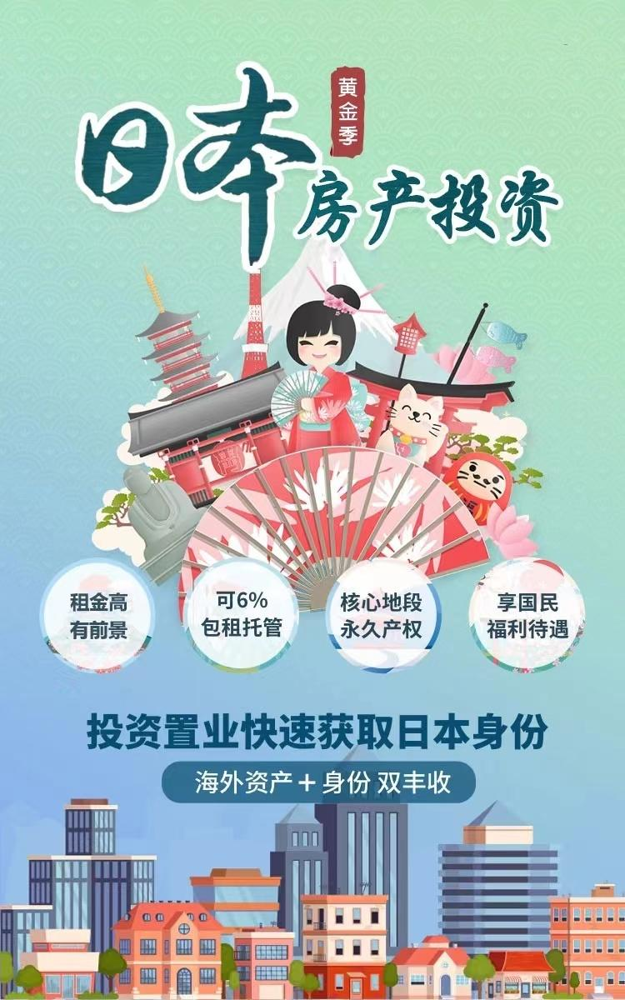

# 移民途径(二)日本经营管理签证介绍篇

## 投资经营管理签证介绍

2006年，日本入国管理局为了吸引外国优秀人才来日本创业定居，同时增强日本的经济活力，推出了投资经营签证。要求申请人在日本设立并且真实运营公司，公司发展有持续及稳定性就可以申请。后来日本入管局逐渐加强了对申请人个人的经营管理能力的考察，并于2015年将【投资经营签证】变更为【经营管理签证】，希望申请人在公司发挥更多的经营和管理才能。投资经营管理签证有效期分为1年、3年、5年。持有投资经营管理签证5年以上可以申请日本国籍，10年以上可以申请绿卡。

## 日本投资经营管理签证优势

1. 申请条件的优势：
   申请投资经营管理签证对投资金额没有要求，只要求500万日元，约合30万人民币的注册资金。同时对申请人没有年龄、语言、学历、工作经验、管理经验的要求，无面试，门槛低。

2. 申请时间的优势：

申请人一般只需要3-6个月即可获得日本入管局核准取得在留资格，有效期一般分为1/3/5年。

3. 资金安全的优势：

申请人不用把资金投入政府指定的某个帐户上，而是作为注册公司的资金存在申请人自己在日本开设新公司的帐户里，所以资金也相当安全。

4. 日本国籍的优势：

申请人在日本拿到5年签证以后便可以申请入籍。日本的护照是亚洲最好用的护照，也是世界上最好用的护照之一，免签国家数甚至超过美国，也是亚洲唯一能和西欧诸国一较高下的护照。

5. 社会治安的优势：

日本是世界公认人身安全最有保障的国家，10万人口中凶恶犯罪事件的发生率远低于美、加、澳。

6. 社会保障制度的优势：

日本的社会保障制度相对完善，医疗方面实行全民国民健康保险制度。孩子是定额制度，老人自付 10%，普通人自付 30%。但注意，每月超过一定数额了（根据您收入不同）国家全包，去除全家的后顾之忧。

7. 子女教育的优势：

日本拥有众多世界著名的大学。因此，移民日本可以使子女得到更好的教育，小学、初中学费全免。