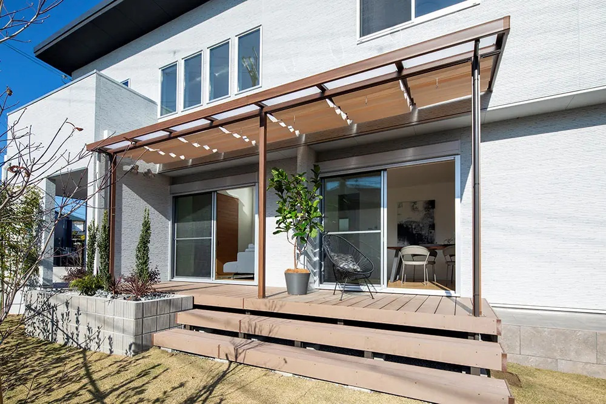
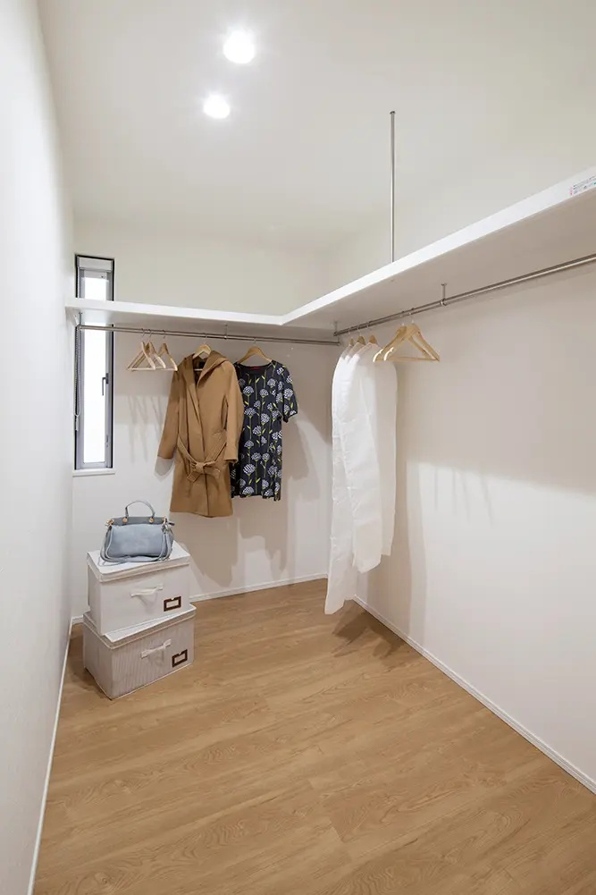
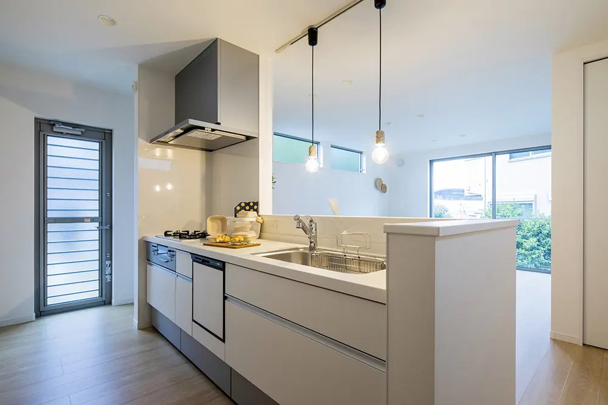
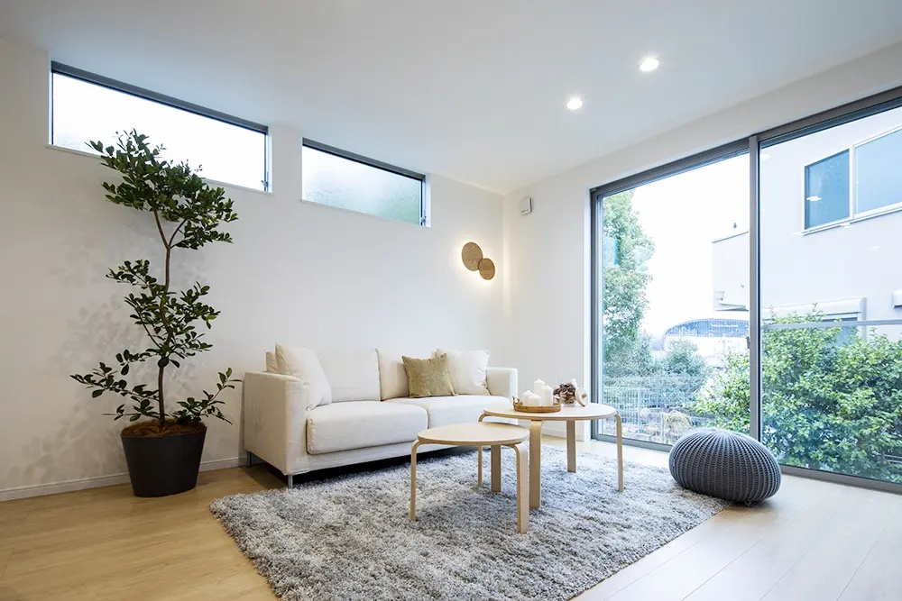
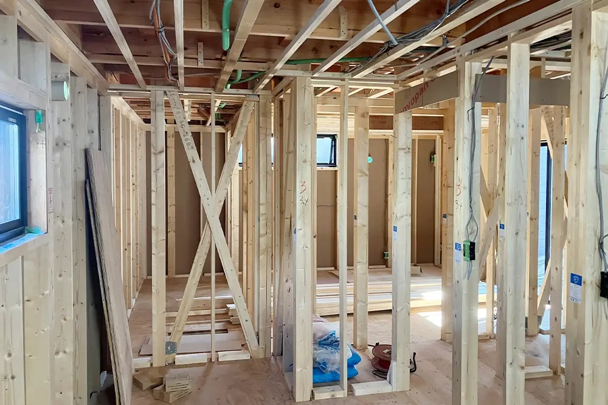
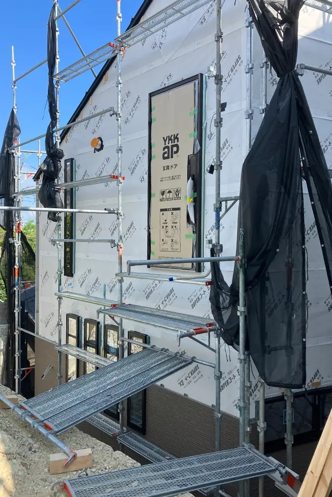
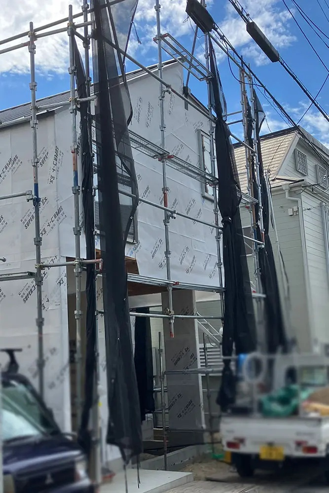
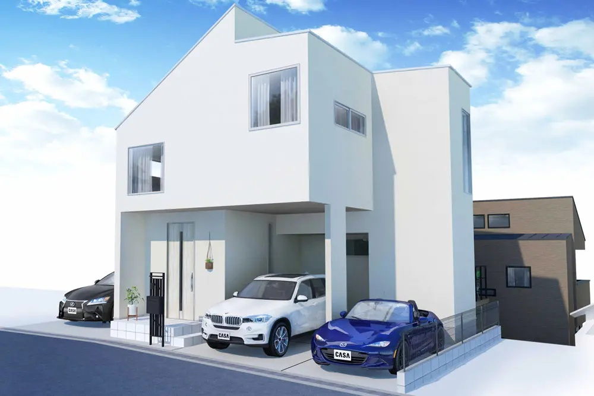

# 丰中市房产投资概述：4980万日元的投资机会

丰中市是位于日本大阪府北部的一个重要住宅区，因其优质的居住环境和便利的交通设施，吸引了许多中高收入家庭和投资者的关注。该地区的房产市场近年来保持稳定，尤其是靠近阪急电铁宝冢线等主要交通线路的房产，具有良好的增值潜力。

#### 关于4980万日元的房产：
这个价格通常对应于丰中市中高档的一户建房产或小型公寓楼，适合自住和投资。在这一价格区间内，你可能会找到3LDK或4LDK的独栋住宅，建筑面积大约为100平方米，通常配备现代化设施和优良的抗震结构。这样的房产多位于靠近车站的便利地段，例如庄内车站或丰中站，步行几分钟即可到达。这些房产不仅适合自住，也具备租赁市场的潜力，尤其是对于希望在大阪都市圈内工作的租户而言。

#### 丰中市的投资潜力：
丰中市不仅以其优美的自然环境闻名（如五月山和附近的猪名川），还拥有便利的交通和完善的社区配套设施。这里不仅有大型购物区和商业设施，而且周围的教育资源丰富，适合家庭居住。这使得丰中市的房产在大阪府内具有很高的保值性和升值潜力。

对于打算投资日本房地产的人来说，丰中市的房产价格相对较为合理，且具有长期投资的吸引力。4980万日元的房产在这个地区内通常可以提供不错的租金回报，尤其是如果房产靠近商业中心和交通枢纽的话。

总的来说，丰中市是一个非常适合进行房产投资的区域，无论是用于自住还是长期持有投资，都具备良好的前景。

