✨✨✨update：12/27为止已满约 有需要的朋友约元旦入住
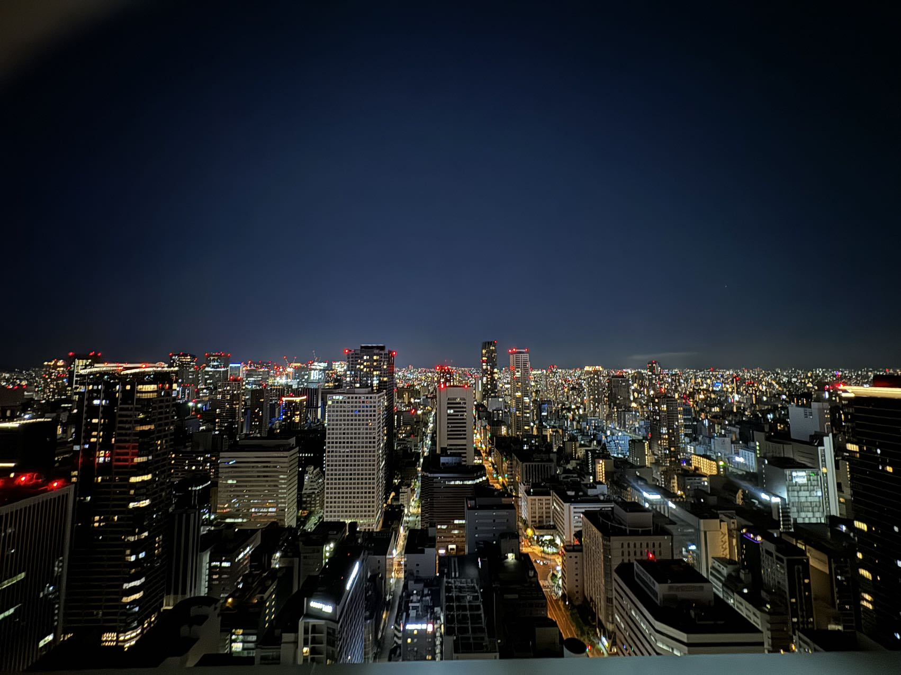

🌃短租公寓塔楼 43楼夜景很不错 使用面积64平米 2ldk 可住4-6个人
👨‍👩‍👧‍👦适合一家子来，或者追求舒适的两人

公寓新家电家具设备齐全
🛏直接拎包入住就ok了

🚇离地铁堺筋本町站1分钟
🚗关西机场开车42分钟

【出行便利】
🌟步行1分钟到达Osaka Metro堺筋線・中央線「堺筋本町」駅
🌟6分钟步行至御堂筋線「本町」駅
🌟从本町站出发，梅田、心斎橋、なんば难波，都在5分钟以内，到新大阪也就11分钟，非常方便

🛍【生活便利】
✨附近有船場センタービル，早上9：00开到晚上22：00。超好逛，药妆名牌包包手表有，半露天咖啡和餐厅🍽有几家也不错
✨周边还有很多本地设计师的宝藏小众店🎁，大多是本地人去，想要大阪时尚深度行不能错过，也大都是5分钟以内步行到达
✨相对于心斋桥比较安静，松弛，life感。比较适合晚上刷街散步拍照，回公寓也是分分钟的事🌃

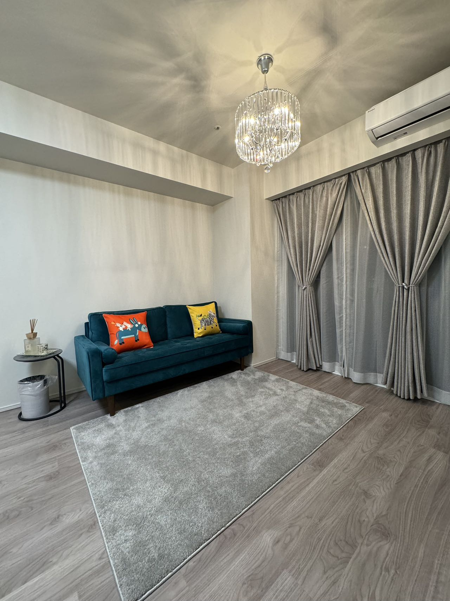
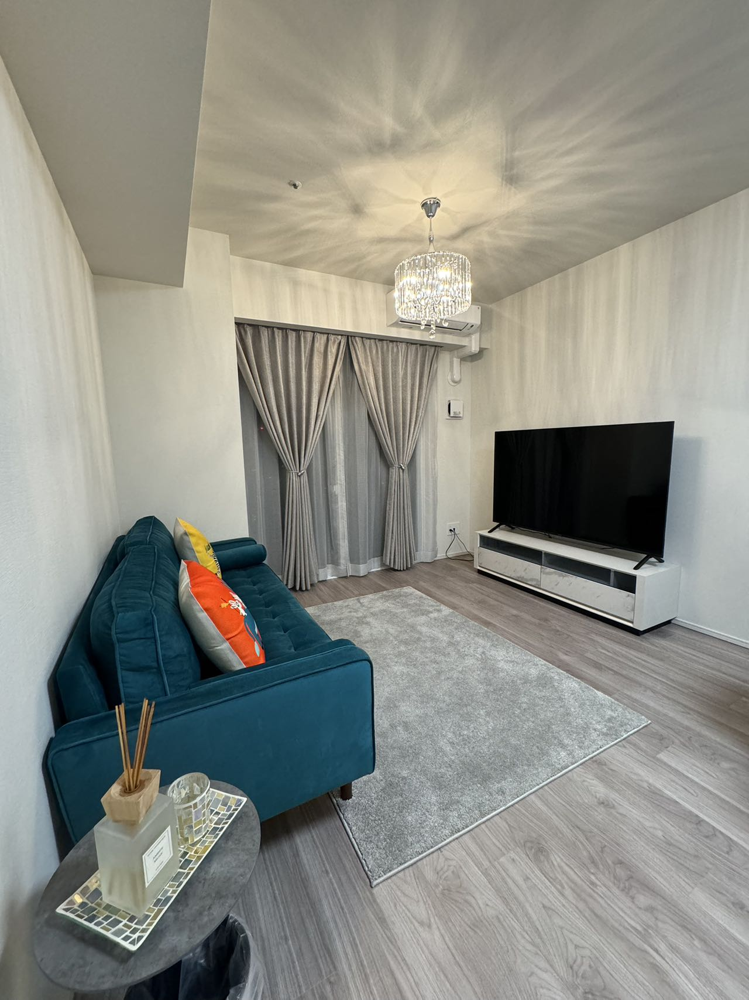
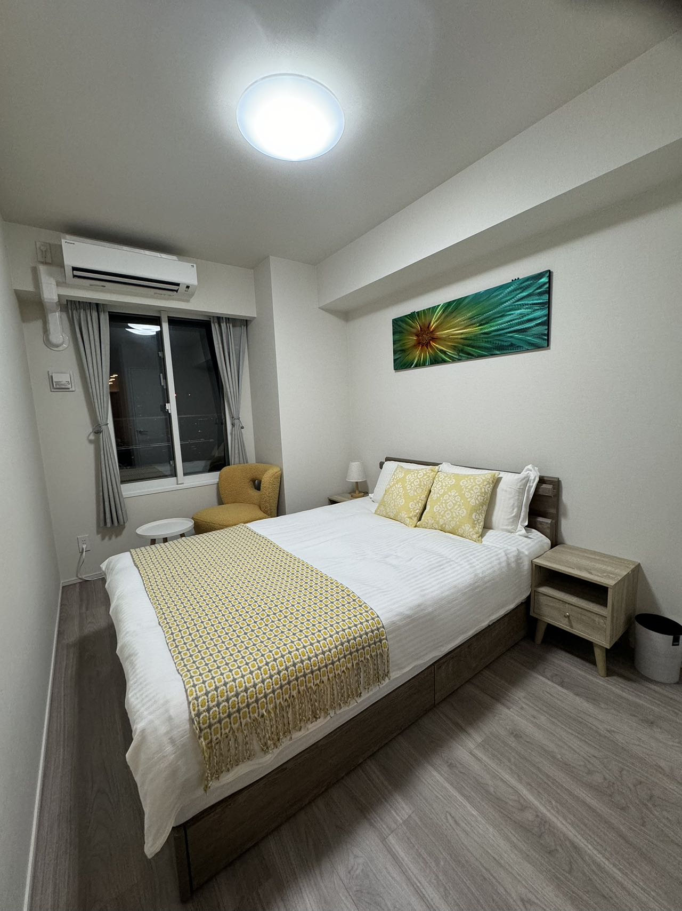
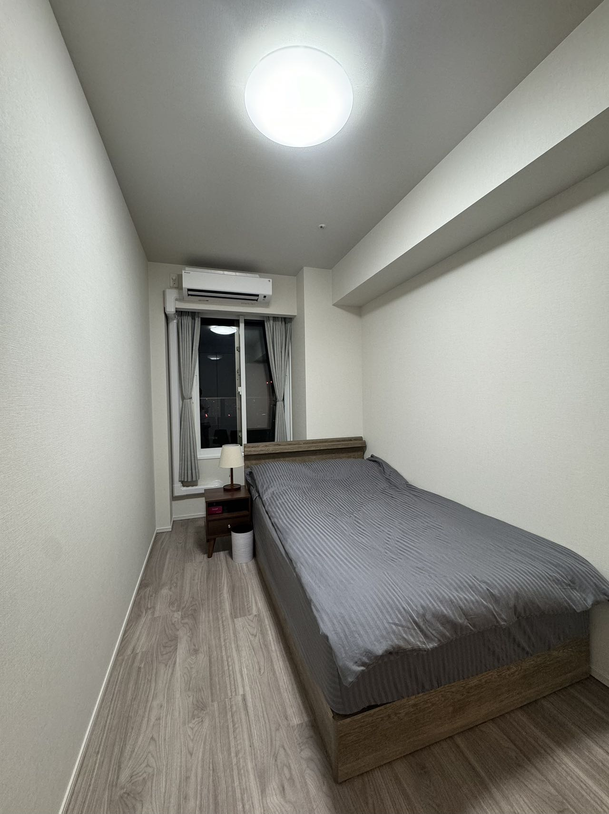
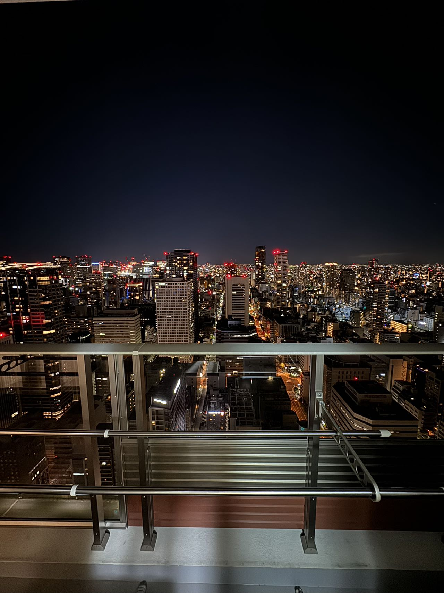
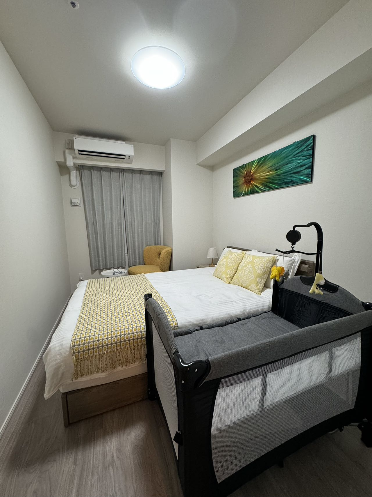
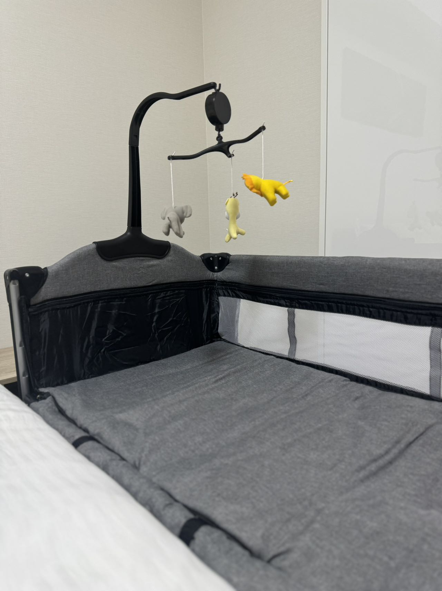
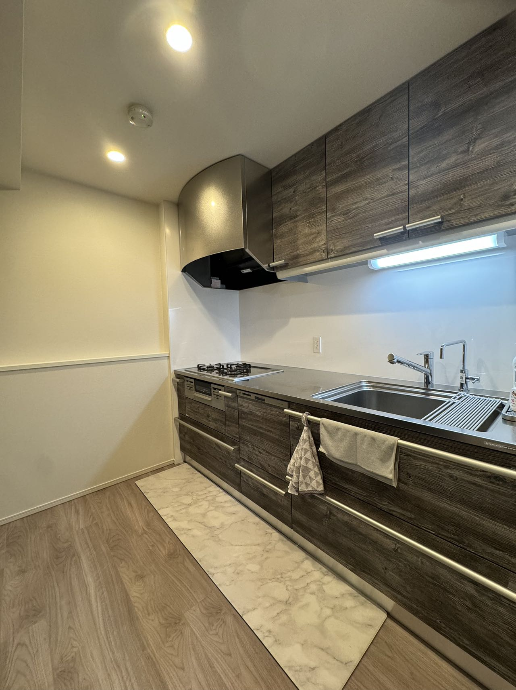
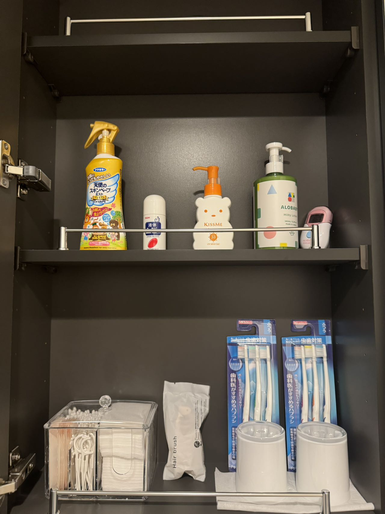
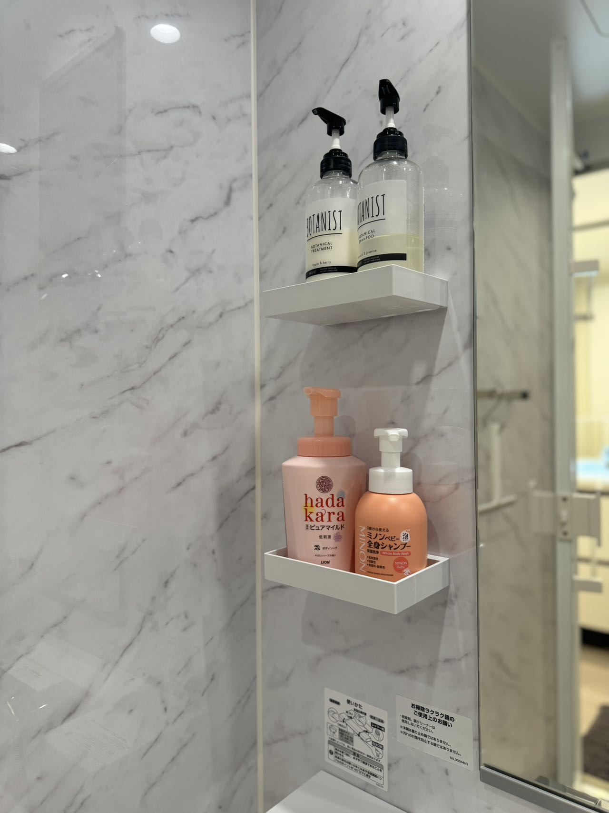

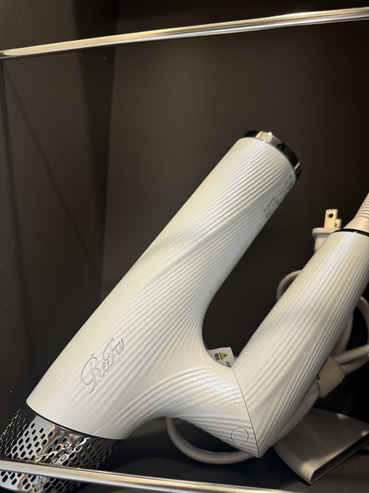
