## 出行便利

- 🌟步行1分钟到达Osaka Metro堺筋線・中央線「堺筋本町」駅 🌟6分钟步行至御堂筋線「本町」駅 

- 🌟从本町站出发，梅田、心斎橋、なんば难波，都在5分钟以内，到新大阪也就11分钟，非常方便 

## 生活便利 

- ✨附近有船場センタービル，早上9：00开到晚上22：00。超好逛，药妆名牌包包手表有，半露天咖啡和餐厅🍽有几家也不错 ✨周边还有很多本地设计师的宝藏小众店🎁，大多是本地人去，想要大阪时尚深度行不能错过，也大都是5分钟以内步行到达 

- ✨相对于心斋桥比较安静，松弛，life感。比较适合晚上刷街散步拍照，回公寓也是分分钟的事🌃

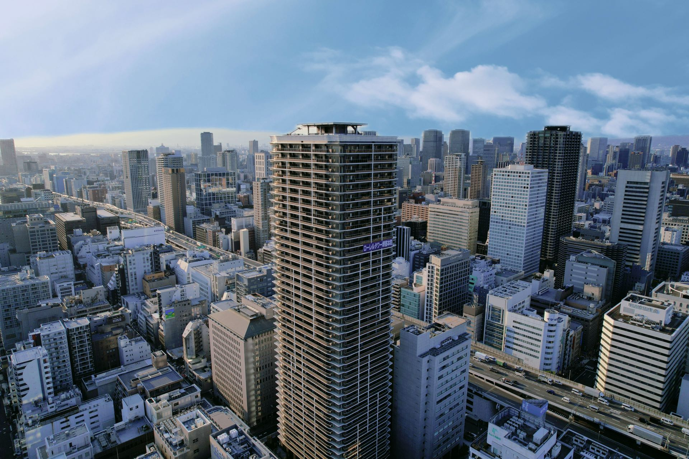
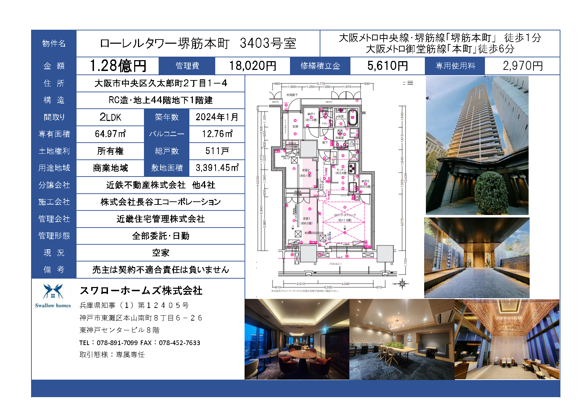
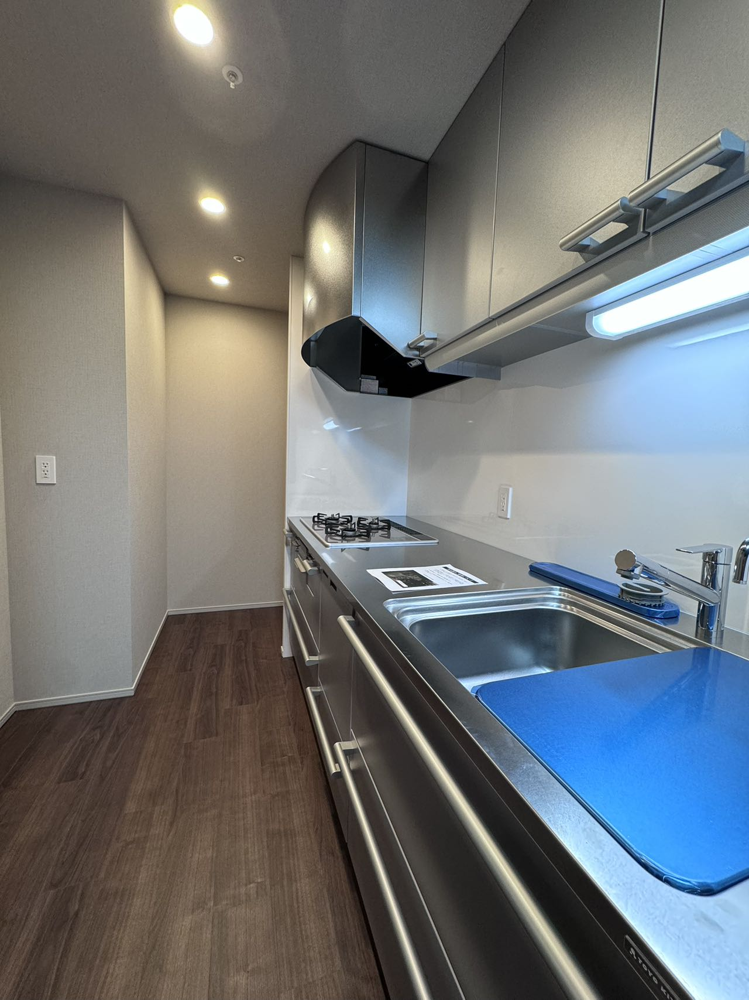
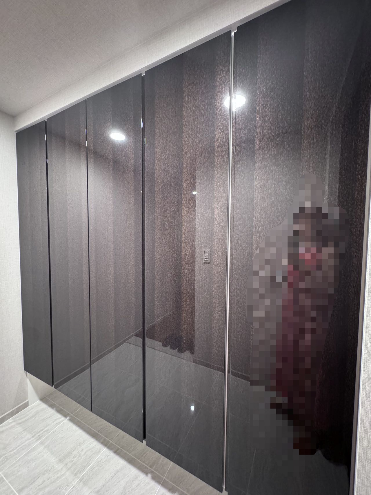
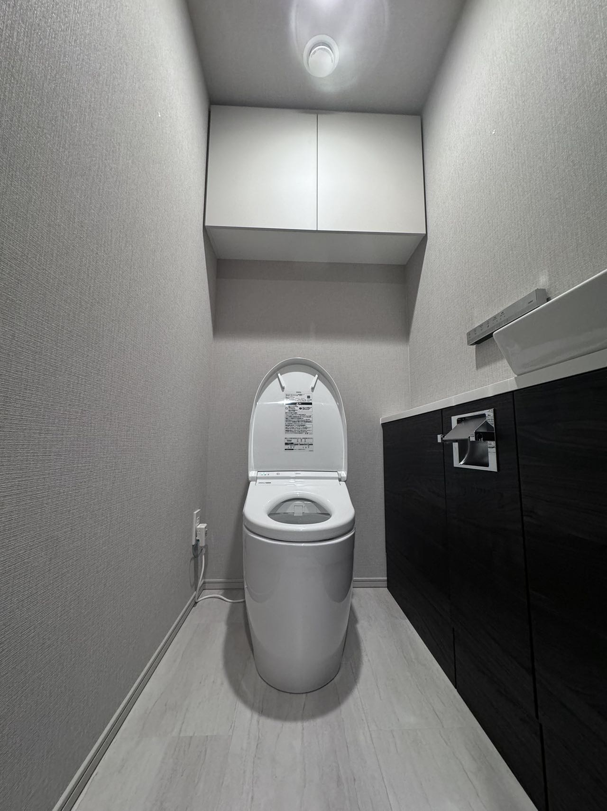
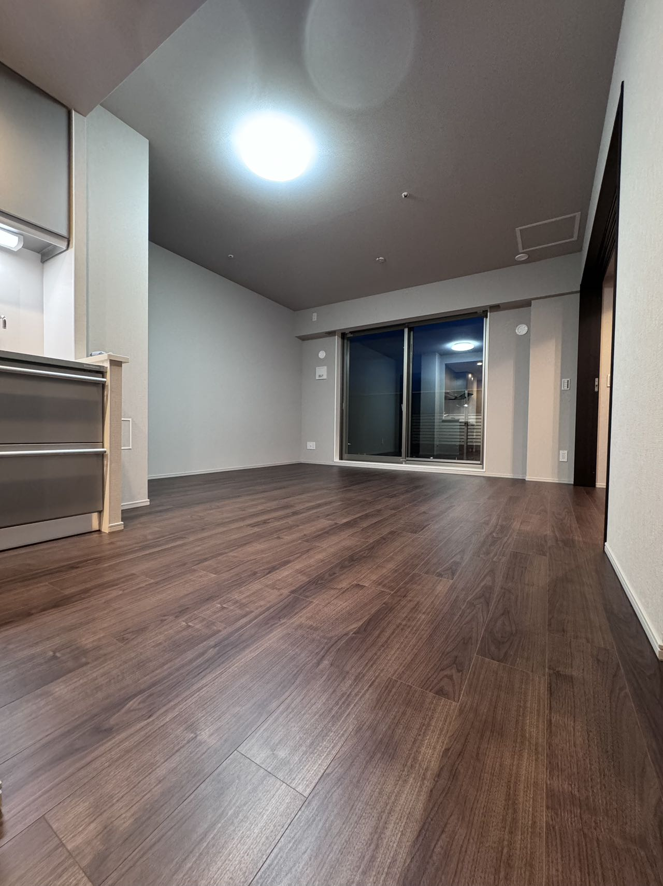
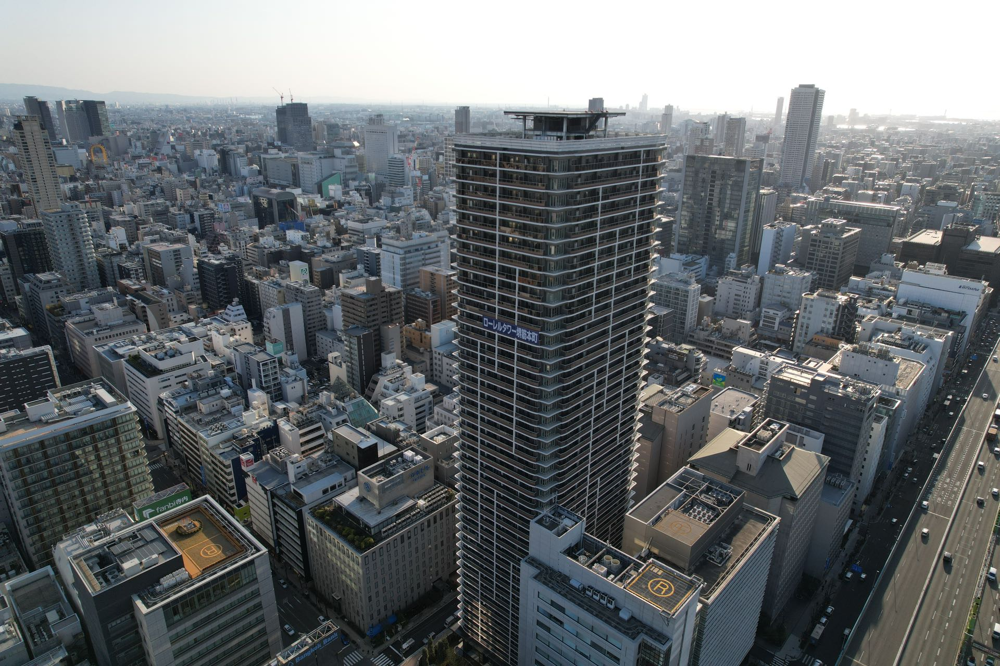
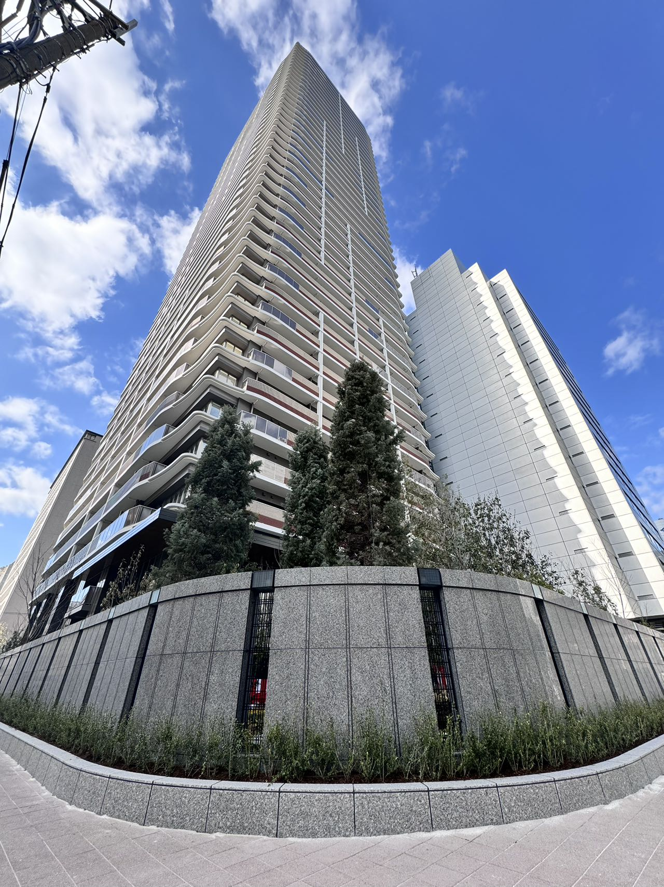

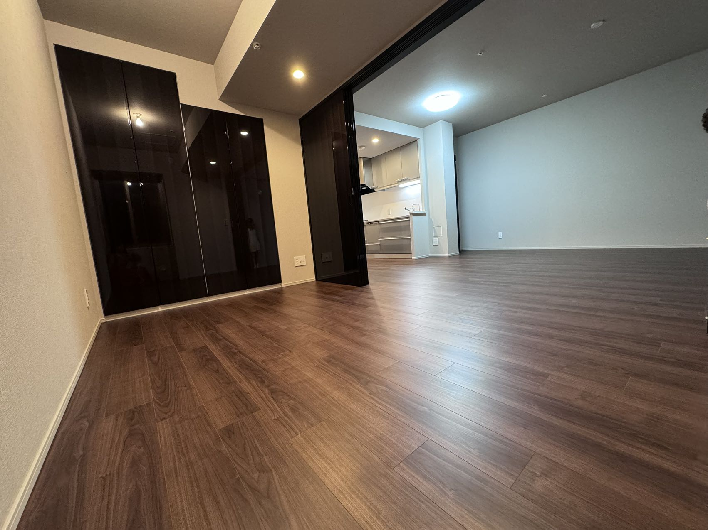
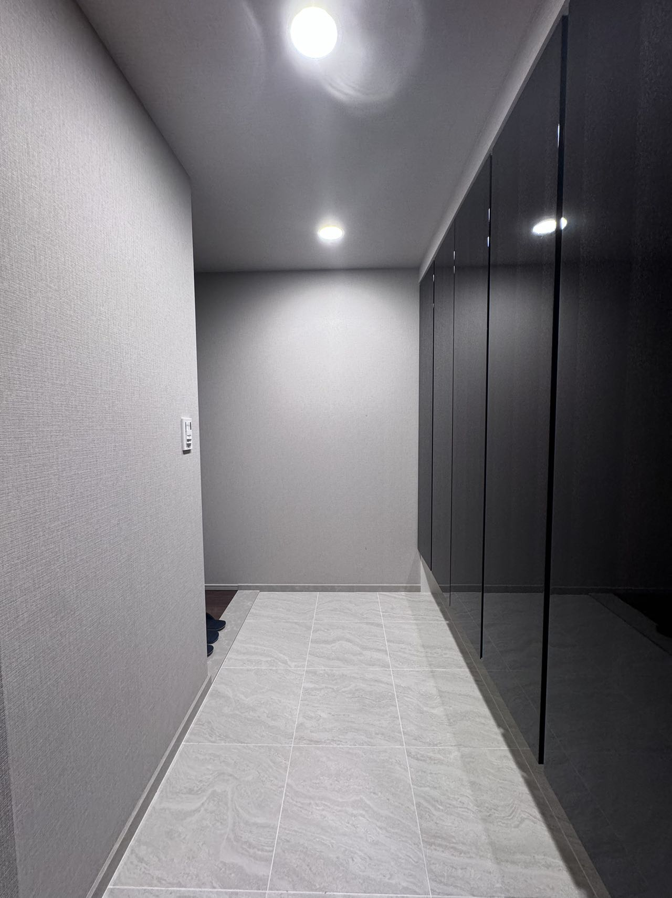

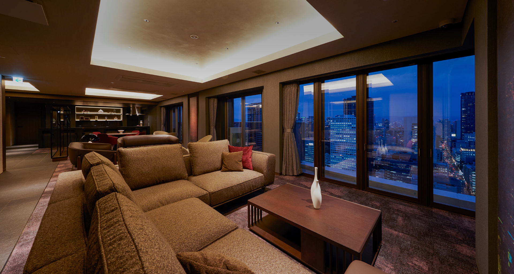
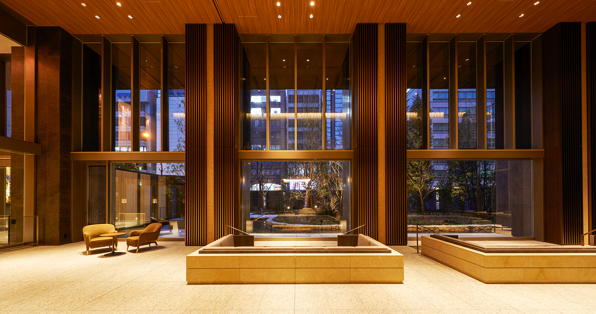
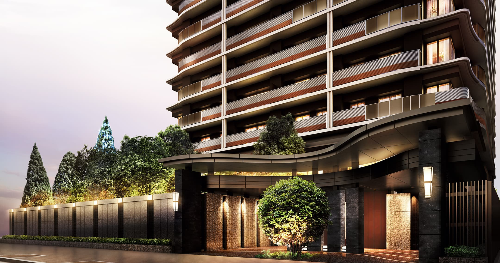
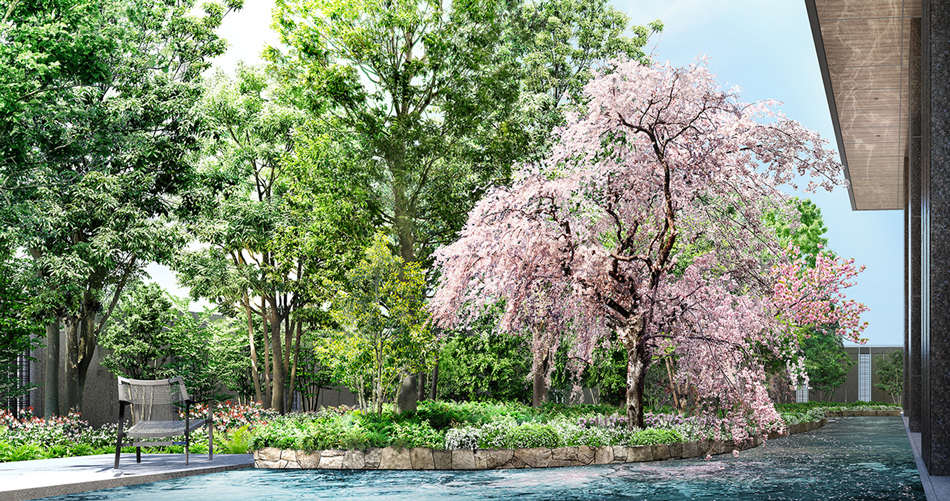

