*日式别墅。银阁寺对面。*

- 土地
229.13平米
- 房屋
182.28平米

## 京都 | 宁静住宅，邂逅哲学之路🎐

在京都市银阁寺参道附近，有一处紧邻哲学之道的住宅。它坐落于周边被围墙和树篱环绕的宁静住宅区一角。

✨遵循 “被围墙环绕的宅邸” 这一周边地区共有的布局，在场地中央布置长方形体量，将周围剩余的细长空间打造成庭院，尽情享受。

🏡一楼采用混凝土核心和纤细钢柱支撑的结构，尽可能营造明亮开放的空间。打开障子门，无论哪个方向都能欣赏到环绕住宅的庭院。

😉与开放的一楼截然不同，二楼是拥有极少窗户的木质空间。在楼梯尽头的阳光房，可确保欣赏到南侧哲学之道的美景，而卧室则保护了室内隐私，不受附近住宅的干扰。

快来感受这份宁静与美好吧💕。
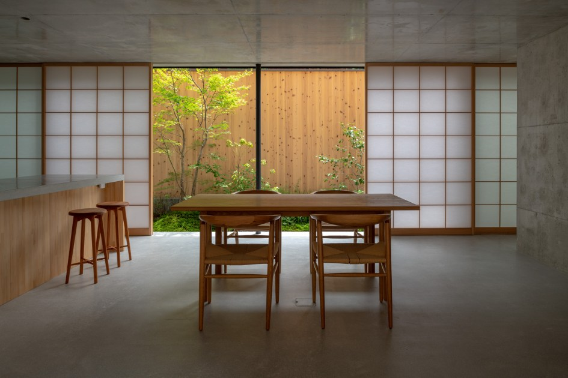
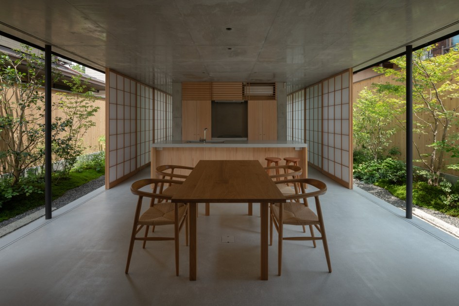
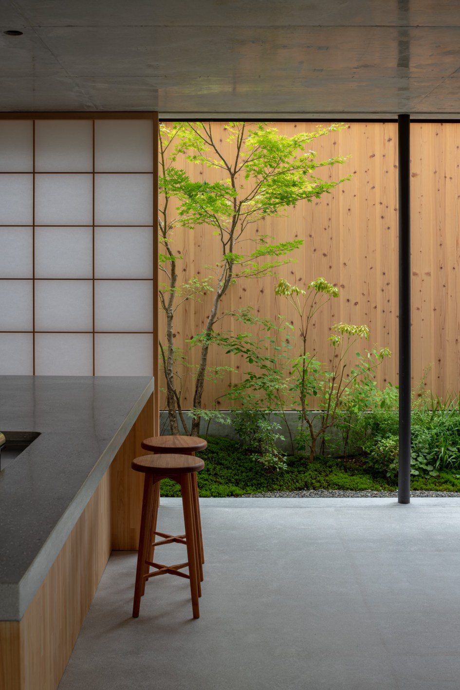
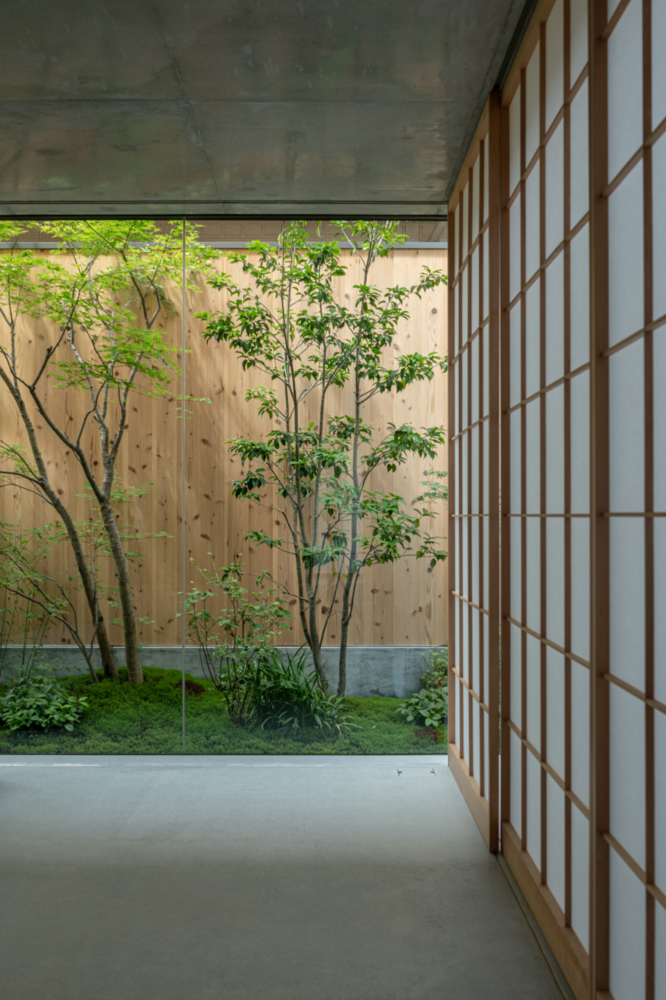
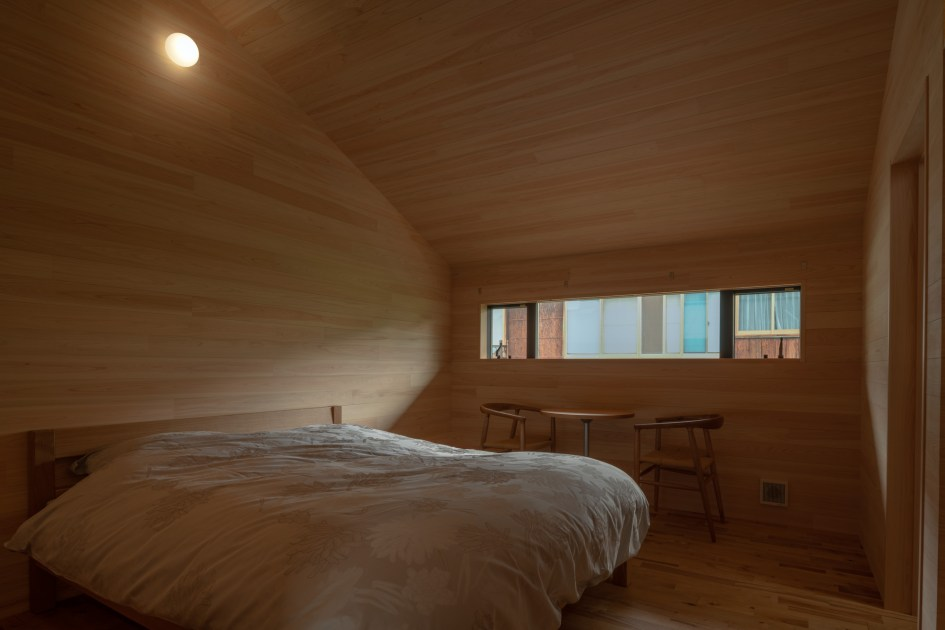
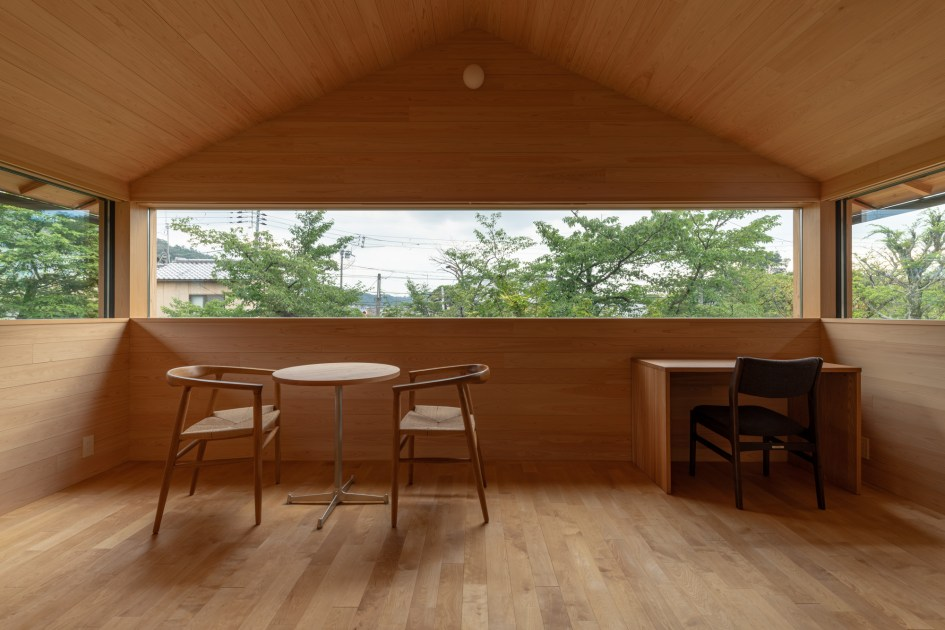

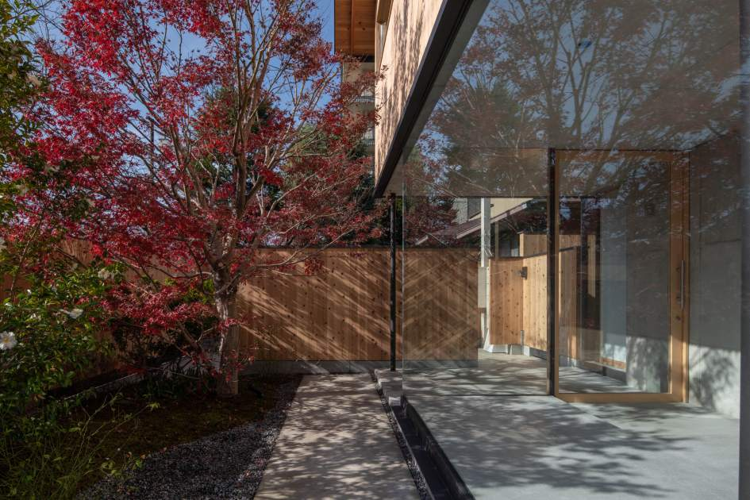
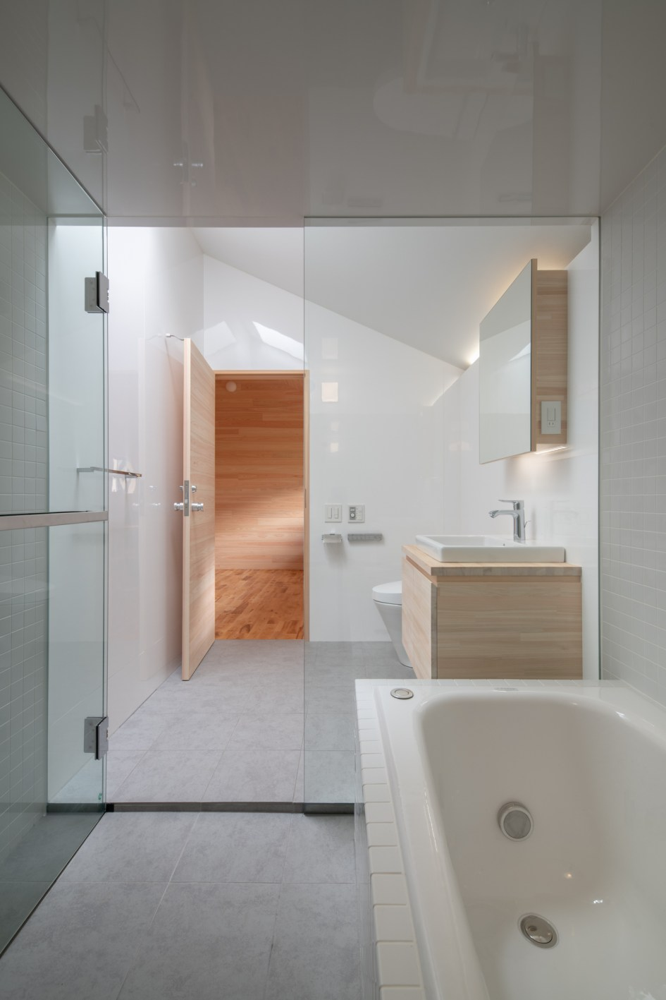

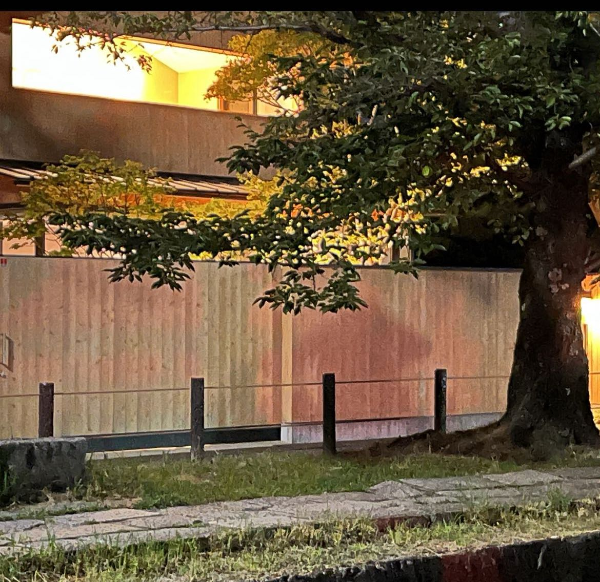
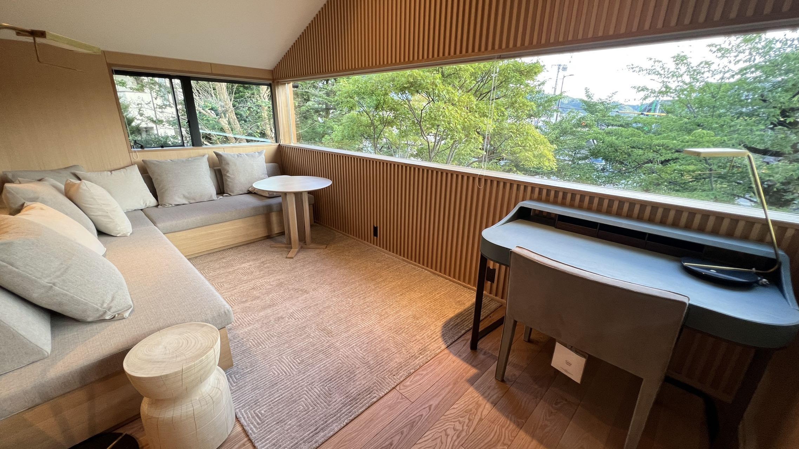
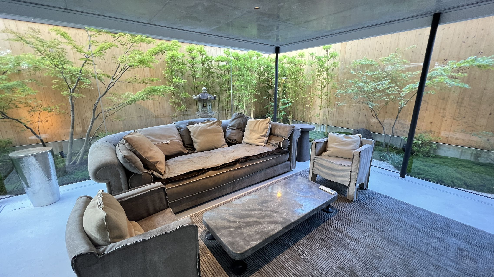
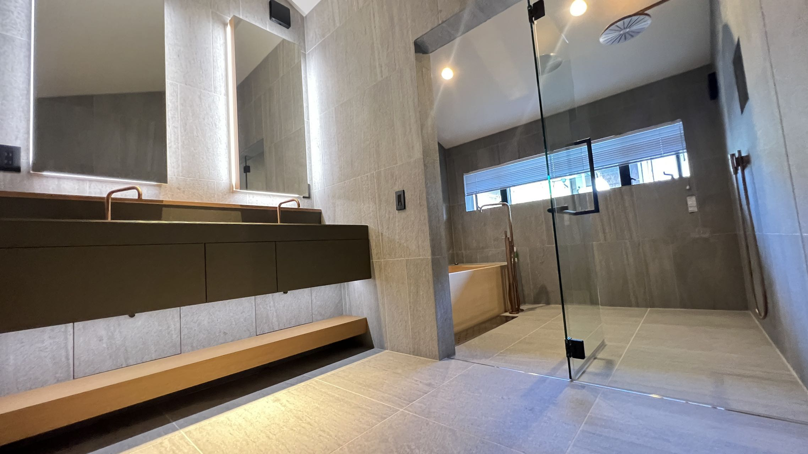
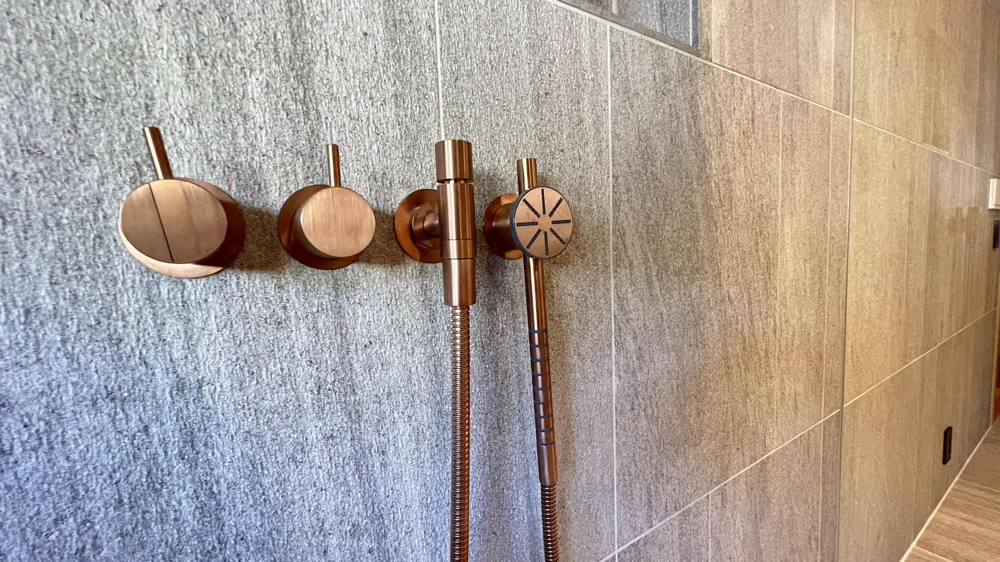
